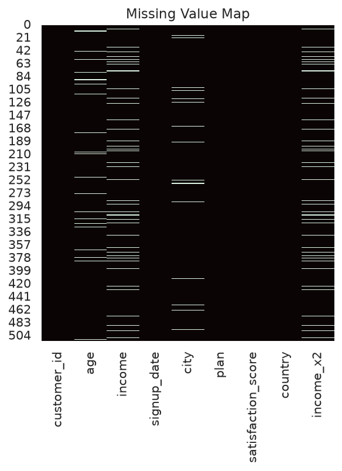
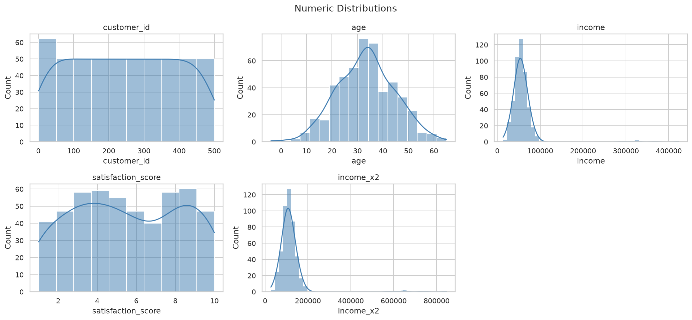
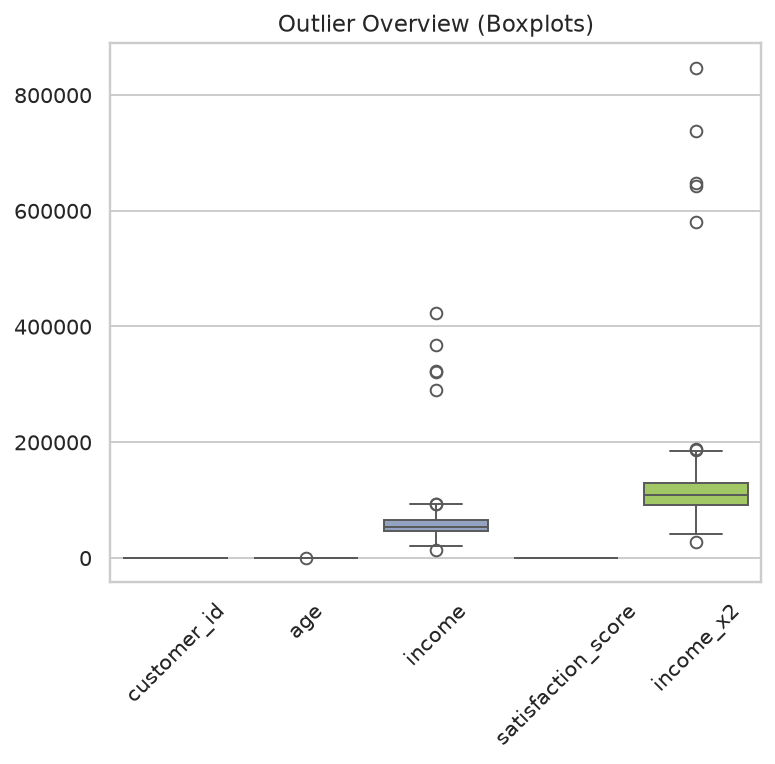
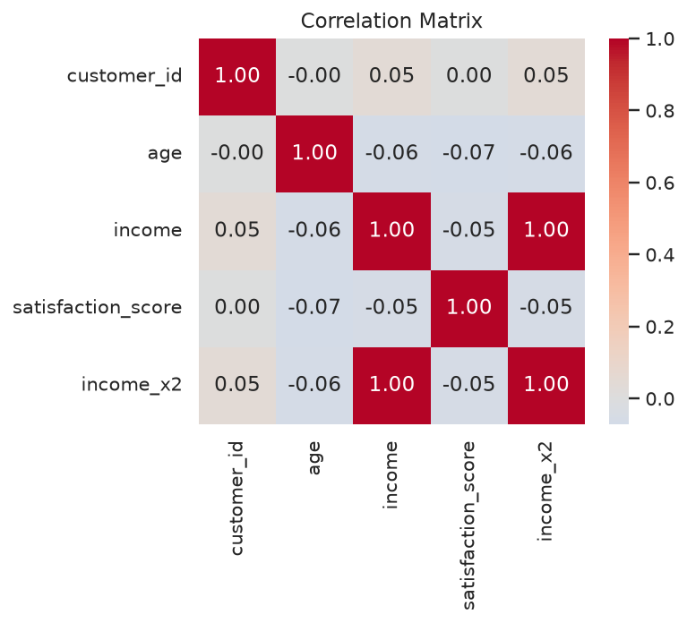
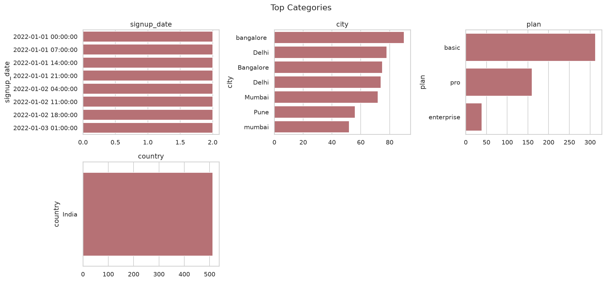

# Data Quality Report — sample_messy_data.csv

- Rows x Columns (raw): **512 x 9**
- Rows x Columns (cleaned): **500 x 9**
- Load time: 0.016s, memory: 0.13 MB, encoding: utf-8

## Column Profile

| name               | dtype   | semantic_type   |   null_pct |   unique |   unique_pct |
|:-------------------|:--------|:----------------|-----------:|---------:|-------------:|
| customer_id        | int64   | numeric         |       0    |      500 |        97.66 |
| age                | float64 | numeric         |       4.1  |       57 |        11.13 |
| income             | float64 | numeric         |       8.01 |      460 |        89.84 |
| signup_date        | str     | datetime        |       0    |      500 |        97.66 |
| city               | str     | categorical     |       2.93 |        7 |         1.37 |
| plan               | str     | categorical     |       0    |        3 |         0.59 |
| satisfaction_score | float64 | numeric         |       0    |       10 |         1.95 |
| country            | str     | categorical     |       0    |        1 |         0.2  |
| income_x2          | float64 | numeric         |       8.01 |      460 |        89.84 |

## Quality Issues

| module      | column    | severity   | description                                  |   count |
|:------------|:----------|:-----------|:---------------------------------------------|--------:|
| duplicates  | nan       | high       | 12 fully duplicated rows                     |      12 |
| outliers    | income    | medium     | 5 values beyond |z|>3.0                      |       5 |
| outliers    | age       | medium     | 1 values beyond |z|>3.0                      |       1 |
| redundancy  | country   | medium     | Constant column (0 or 1 unique values)       |     nan |
| outliers    | income_x2 | medium     | 5 values beyond |z|>3.0                      |       5 |
| missingness | city      | low        | 2.9% missing                                 |      15 |
| missingness | age       | low        | 4.1% missing                                 |      21 |
| missingness | income    | low        | 8.0% missing                                 |      41 |
| missingness | income_x2 | low        | 8.0% missing                                 |      41 |
| consistency | city      | low        | 168 values have leading/trailing whitespace  |     168 |
| consistency | city      | low        | Case inconsistency collapses 7->4 categories |     nan |

Summary: {'low': 6, 'medium': 4, 'high': 1}

## Numeric Statistics

|                    |   count |       mean |       std |     min |      25% |      50% |       75% |    max |   skew |   kurtosis |   missing_pct |
|:-------------------|--------:|-----------:|----------:|--------:|---------:|---------:|----------:|-------:|-------:|-----------:|--------------:|
| customer_id        |     512 |    244.781 |   147.48  |     1   |   116.75 |    244.5 |    372.25 |    500 |  0.01  |     -1.212 |         0     |
| age                |     491 |     33.393 |    11.215 |    -4   |    25    |     34   |     41    |     65 | -0.011 |     -0.074 |         4.102 |
| income             |     471 |  57804.6   | 33296.9   | 13593.7 | 45849.3  |  54025.3 |  64680.5  | 423267 |  7.387 |     66.964 |         8.008 |
| satisfaction_score |     512 |      5.578 |     2.82  |     1   |     3    |      5   |      8    |     10 |  0.008 |     -1.232 |         0     |
| income_x2          |     471 | 115612     | 66632.3   | 27190.5 | 91845.6  | 107861   | 129265    | 846763 |  7.384 |     66.923 |         8.008 |

## Strong Correlations (|r| >= 0.7)

- income <-> income_x2: r=1.0

## Cleaning Actions

- Stripped whitespace on 4 text columns
- Dropped 12 duplicate rows
- Imputed numeric NaNs with median, categorical with mode

## Visualizations

